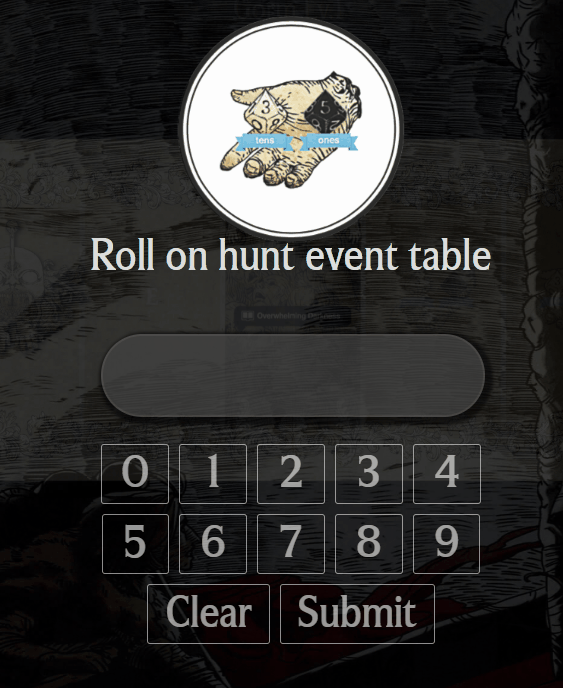

## Info
Here are some additions/mods made to the KDM Helper App found here:
https://kdm-story.site/

----

## Install
_assumes you have the [kdm-sotry app](https://kdm-story.site/) installed_  
Download and paste/overwrite all these files into the following folder:  
`\resources\app`

----
### Discussion/Community
Discuss the `kdm-story` app with the BGG community here:
https://boardgamegeek.com/article/31989187

----

## Mod List

* __Hunt Event Input Pad__  
mouse friendly keypad for entering hunt event numbers  

* __Reference Keyboard__
mouse friendly keyboard for entering reference entires

----
#### Notes

_The intention is to keep these mods updated and compatible with any changes made to the official app (always assuming the latest version is being used).  Eventually we may be able to merge these changes in once the official app can be contributed to in open source fashion._

_feedback welcome_